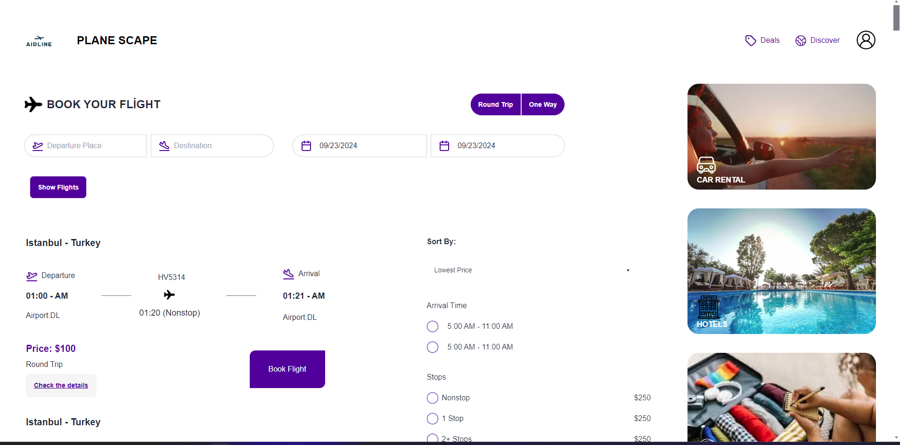
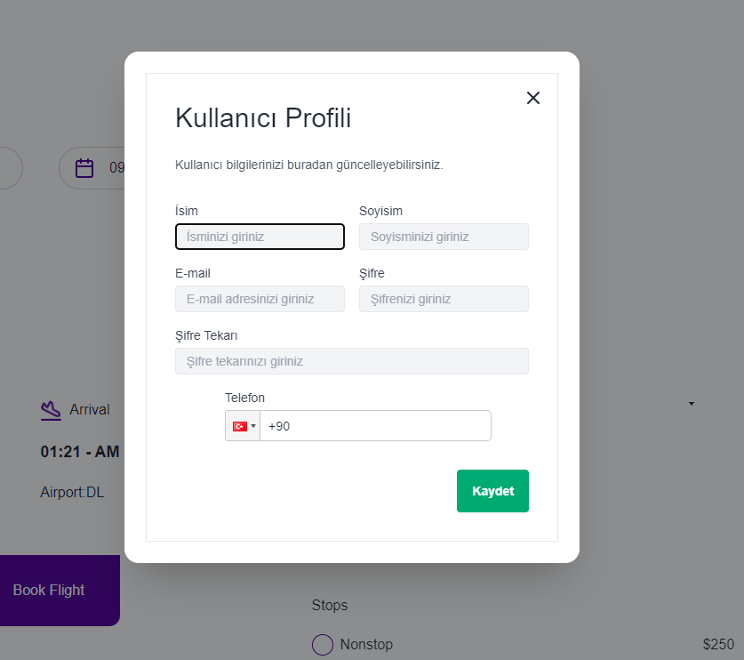
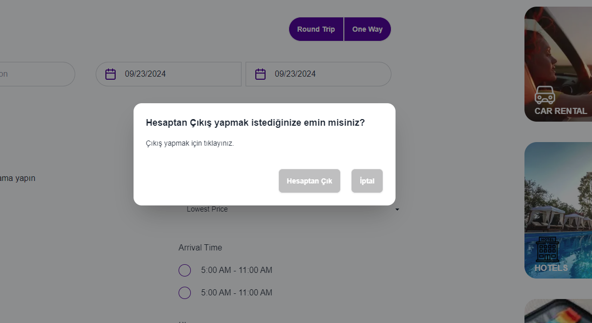
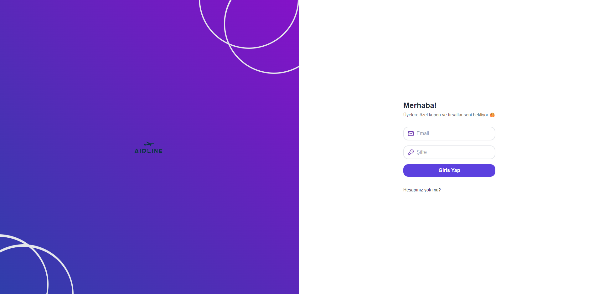
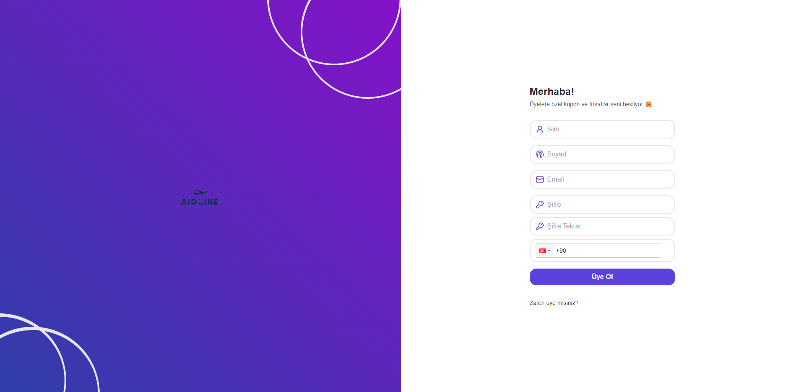
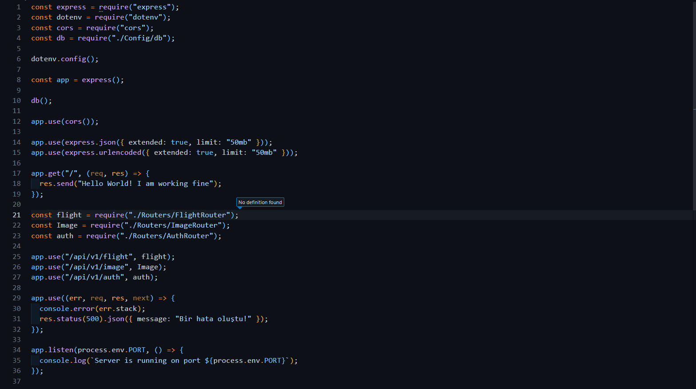

# Proje Yapısı ve Çalışma Süreci Üzerine Kısa Bir Değerlendirme

Bu proje, iki ana bileşen olan backend ve frontend'den oluşmaktadır. Projenin başarılı bir şekilde çalışabilmesi için öncelikle backend kısmının başlatılması gerekmektedir. Bunun için terminalde ilk `npm install` sonra `npm start` komutu kullanılarak backend projesi aktive edilir. Ardından, frontend'in çalışabilmesi için yine terminalde `npm install` ve sonra `npm run dev` komutu ile frontend bileşeni devreye alınacaktır.

 <!--  Frontend Bileşenleri -->

Frontend kısmında, Next.js, DaisyUI ve TailwindCSS gibi modern teknolojiler kullanılmıştır. Bunun yanı sıra, durumlardaki yönetim için Redux Toolkit ve redux-persist uygulanmıştır. Proje içerisinde kullanıcıların işlemlerini gerçekleştirmesi için Axios kütüphanesi ile API çağrıları yapılmaktadır.

##  <!-- Frontend Bileşenleri -->

## 

## 

## 

Kullanıcılar, frontend arabirimi üzerinden çeşitli işlemleri gerçekleştirebilmektedir. Bu işlemler arasında üye olma, üye girişi, hesap bilgilerinin güncellenmesi, hesaptan çıkış yapma ve hesap silme gibi temel işlemler bulunmaktadır. Ayrıca, ana sayfa üzerinden uçuş bilgileri gibi özel bilgilere ulaşmaları sağlanmaktadır.

 <!-- Backend Yapısı -->

Backend tarafında ise, Node.js, Express.js ve MongoDB gibi güvenilir teknolojilerden yararlanılmıştır. Projenin yapısına dair önemli bileşenler arasında model, controller, router ve config dosyaları yer almaktadır. Modeller, veritabanı yapısını tanımlarken, controller'lar iş mantığının uygulandığı alanlardır. Router'lar ise API uç noktalarının yönetimini sağlar. Config dosyası ise veritabanı bağlantılarının düzenlendiği yerdir.
